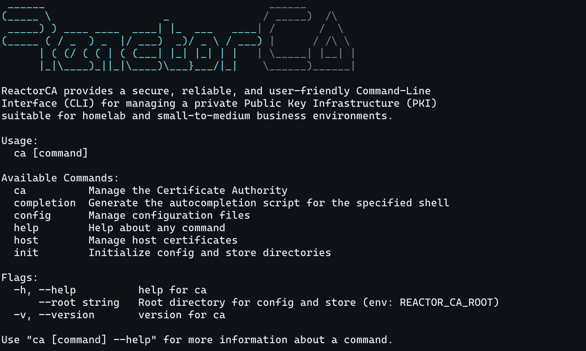

[](https://opensource.org/license/bsd-2-clause)

# ReactorCA

A Go CLI tool to manage a homelab/small-office Certificate Authority.

Typical usage scenario: Run it on your desktop to renew and deploy certificates for your LAN/VPN devices once a year or once a month.

## Features

- Create and manage a self-signed Certificate Authority
- Generate and renew certificates for hosts
- Strong key encryption with multiple providers:
  - Password-based encryption using age with scrypt key derivation
  - SSH key-based encryption using existing SSH identities (age-ssh)
  - Hardware token encryption using age plugins (Secure Enclave, YubiKey, etc.)
- Certificate inventory and expiration tracking
- Certificate chain support (CA + host certificate)
- Flexible authentication options (interactive prompt, environment variable, file, SSH keys)
- Export unencrypted private keys when needed
- Simple deployment to target locations via shell scripts
- Single statically-linked binary with no runtime dependencies

## Motivation and Design Targets

ReactorCA fills a gap in the homelab PKI space by providing:

- **Command-line focused**: Unlike GUI-heavy tools like [XCA](https://www.hohnstaedt.de/xca/), ReactorCA is built for automation and scripting
- **Modern implementation**: Addresses limitations of older tools like [easy-ca](https://github.com/redredgroovy/easy-ca) with updated cryptographic standards
- **Plug & play**: Minimal configuration required to get started
- **Secure by default**: Strong encryption, secure key storage, and safe deployment practices built-in

## Cryptographic Implementation

ReactorCA is built on proven cryptographic foundations:

### Core Libraries
- **Go Standard Crypto**: Uses `crypto/x509` for certificate operations, `crypto/rsa` and `crypto/ecdsa` for key generation (RSA 2048-4096, ECDSA P-256/384/521, Ed25519), and `crypto/rand` for secure randomness
- **age Encryption**: Modern file encryption using [Filippo Valsorda's age library](https://github.com/FiloSottile/age) for private key protection
- **age-ssh**: SSH key integration allowing use of existing SSH identities for key encryption/decryption
- **age plugins**: Hardware token integration for Secure Enclave, YubiKey, and other supported devices

### Key Protection
Every `.key.age` file is encrypted using one of two methods:

**Password-based encryption**:
- **ChaCha20-Poly1305**: Modern authenticated encryption for private keys
- **scrypt**: Strong password-based key derivation
- **age format**: Battle-tested encryption with simple, secure design

**SSH key-based encryption** (age-ssh):
- Uses existing SSH private keys as age identities
- SSH public keys serve as age recipients
- Leverages proven SSH key infrastructure
- Supports Ed25519, RSA, and ECDSA SSH keys

**Hardware token encryption** (age plugins):
- Uses age-plugin-* binaries for hardware token support
- Secure Enclave integration (macOS)
- YubiKey support
- Future-proof plugin architecture for new hardware

## Installation

### Pre-built Binaries

Download the latest release for your platform from the [releases page](https://github.com/your-org/reactor-ca/releases).

### Build from Source

```bash
git clone https://github.com/serpent213/reactor-ca.git
cd reactor-ca
go build -o ca ./cmd/ca
```

## Quick Start

### 1. Initialize Configuration

First, create the default config files:

```bash
ca init
```

This creates default configuration files in the `config/` directory. Edit them according to your needs.

### 2. Create CA Certificate

After editing the configuration, create the CA:

```bash
ca ca create
```

This creates a self-signed CA certificate and private key (encrypted with the password you provide).

### 3. Issue Host Certificate

To issue a certificate for a host defined in your hosts.yaml:

```bash
ca host issue web-server-example
```

### 4. List Certificates

To list all certificates with their expiration dates:

```bash
ca host list
```

### 5. Deploy Certificate

To run the deployment command for a host:

```bash
ca host deploy web-server-example
```

## CLI Reference

### Global Flags

- `--root <path>` - Root directory for config and store (env: `REACTOR_CA_ROOT`)

### CA Management

| Command | Description |
|---------|-------------|
| `ca ca create` | Create a new CA key and self-signed certificate |
| `ca ca renew` | Renew the CA certificate using the existing key |
| `ca ca rekey` | Create a new key and certificate, replacing the old ones |
| `ca ca info` | Display detailed information about the CA certificate |
| `ca ca import --cert <path> --key <path>` | Import an existing CA certificate and private key |
| `ca ca passwd` | Change the master password for all encrypted keys |

### Host Certificate Management

| Command | Description |
|---------|-------------|
| `ca host issue <host-id>` | Issue/renew a certificate for a host |
| `ca host issue --all` | Issue/renew certificates for all hosts |
| `ca host issue <host-id> --rekey` | Force generation of a new private key |
| `ca host issue <host-id> --deploy` | Issue and deploy certificate in one step |
| `ca host list` | List all host certificates with their status |
| `ca host list --expired` | Show only expired certificates |
| `ca host list --expiring-in 30` | Show certificates expiring in next 30 days |
| `ca host list --json` | Output in JSON format |
| `ca host info <host-id>` | Display detailed certificate information |
| `ca host deploy <host-id>` | Run deployment command for a host |
| `ca host deploy --all` | Deploy all host certificates |
| `ca host export-key <host-id>` | Export unencrypted private key to stdout |
| `ca host export-key <host-id> -o file.key` | Export private key to file |
| `ca host import-key <host-id> --key <path>` | Import existing private key |
| `ca host sign-csr --csr <path> --out <path>` | Sign external CSR |
| `ca host clean` | Remove certificates for hosts no longer in config |

### Configuration Management

| Command | Description |
|---------|-------------|
| `ca config validate` | Validate configuration files |

## Common Workflows

### New CA Workflow

```bash
# Initialize configuration
ca init

# Edit configuration
vim config/ca.yaml

# Create the CA
ca ca create

# Edit host configuration
vim config/hosts.yaml

# Issue certificates
ca host issue web-server-example
```

### Import Existing CA

```bash
# Initialize configuration (optional)
ca init

# Import existing CA
./reactor-ca ca import --cert path/to/ca.crt --key path/to/ca.key

# Edit host configuration
vim config/hosts.yaml

# Issue certificates
ca host issue web-server-example
```

### Certificate Renewal

```bash
# Renew a specific certificate
ca host issue web-server-example

# Renew all certificates
./reactor-ca host issue --all

# Renew and deploy
ca host issue web-server-example --deploy
```

### Key Rotation

```bash
# Rotate the CA key and certificate
./reactor-ca ca rekey

# Rotate a specific host key and certificate
ca host issue web-server-example --rekey

# Rotate all host keys and certificates
./reactor-ca host issue --all --rekey
```

## Configuration

### CA Configuration (`config/ca.yaml`)

```yaml
ca:
  # Subject details for the CA certificate
  subject:
    common_name: "Reactor Homelab CA"
    organization: "Reactor Industries"
    organization_unit: "IT Department"
    country: "DE"
    state: "Berlin"
    locality: "Berlin"
    email: "admin@reactor.dev"

  # Certificate validity
  validity:
    years: 10

  # Cryptographic settings
  key_algorithm: "ECP384"    # RSA2048, RSA3072, RSA4096, ECP256, ECP384, ECP521, ED25519
  hash_algorithm: "SHA384"   # SHA256, SHA384, SHA512

  # Password management
  password:
    min_length: 12
    env_var: "REACTOR_CA_PASSWORD"  # Environment variable for password
    # file: "/path/to/password/file"  # Optional: password file path

# Encryption configuration
encryption:
  provider: "password"  # password | ssh | plugin
  password:
    min_length: 12
    env_var: "REACTOR_CA_PASSWORD"
  ssh:
    identity_file: "~/.ssh/id_ed25519"  # SSH private key for decryption
    recipients:  # SSH public keys for encryption
      - "ssh-ed25519 AAAAC3NzaC1lZDI1NTE5AAAAIExample user@host"
      - "ssh-rsa AAAAB3NzaC1yc2EAAAADAQABAAABgExample user@host"
  plugin:
    identity_file: "~/.age/plugin-identity.txt"  # age plugin identity
    recipients:  # age plugin recipients
      - "age1se1qgg72x2qfk9wg3wh0qg9u0v7l5dkq4jx69fv80p6wdus3ftg6flwgjgtev8"  # Secure Enclave
      - "age1yubikey1qgg72x2qfk9wg3wh0qg9u0v7l5dkq4jx69fv80p6wdus3ftg6flwgjgtev8"  # YubiKey
```

### Hosts Configuration (`config/hosts.yaml`)

```yaml
hosts:
  web-server-example:
    subject:
      common_name: "web.reactor.local"
    
    # Subject Alternative Names
    alternative_names:
      dns:
        - "web.reactor.local"
        - "grafana.reactor.local"
      ip:
        - "192.168.1.100"
        - "10.10.0.1"
    
    # Certificate validity
    validity:
      years: 1
    
    # Cryptographic settings (optional, defaults to CA settings)
    key_algorithm: "RSA2048"
    hash_algorithm: "SHA256"
    
    # Export paths (optional). These paths can be used in the deploy commands.
    export:
      cert: "/etc/ssl/certs/web-server.pem"
      chain: "/etc/ssl/certs/web-server-chain.pem"
    
    # Deployment commands (optional). Executed as a shell script.
    # Variables:
    # - ${cert}: Path to the exported certificate.
    # - ${chain}: Path to the exported chain file.
    # - ${private_key}: Path to a temporary, unencrypted private key file (securely handled).
    deploy:
      commands:
        - "echo 'Reloading NGINX...'"
        - "systemctl reload nginx"
```

## Store Structure

```
store/
├── ca/
│   ├── ca.crt         # CA certificate (PEM format)
│   └── ca.key.age     # age-encrypted CA private key
├── hosts/
│   └── <host-id>/
│       ├── cert.crt   # Host certificate (PEM format)
│       └── cert.key.age # age-encrypted host private key
└── ca.log             # Operation log
```

## Cryptographic Options

### Supported Key Algorithms

| Algorithm | Key Size | Performance | Security | Compatibility |
|-----------|----------|-------------|-----------|---------------|
| RSA2048   | 2048-bit | Medium      | Good      | Excellent     |
| RSA3072   | 3072-bit | Slow        | Strong    | Excellent     |
| RSA4096   | 4096-bit | Slow        | Very Strong| Excellent     |
| ECP256    | P-256    | Fast        | Strong    | Good          |
| ECP384    | P-384    | Medium      | Very Strong| Good          |
| ECP521    | P-521    | Medium      | Very Strong| Good        |
| ED25519   | 256-bit  | Very Fast   | Strong    | Modern only   |

### Supported Hash Algorithms

- **SHA256**: Good default, excellent compatibility
- **SHA384**: Stronger, recommended for ECP384 and higher
- **SHA512**: Strongest, for high-security environments

### Subject Alternative Name Types

ReactorCA supports multiple SAN types:

```yaml
alternative_names:
  dns:
    - "example.com"
    - "*.example.com"
  ip:
    - "192.168.1.100"
    - "2001:db8::1"
  email:
    - "admin@example.com"
  uri:
    - "https://example.com"
```

## Key Protection and Authentication

ReactorCA supports multiple encryption providers for private key protection:

### Password-based Encryption (default)
Password sources are checked in order:
1. **Password File**: Specified in `ca.yaml` under `password.file`
2. **Environment Variable**: Set via `REACTOR_CA_PASSWORD` (or custom env var)
3. **Interactive Prompt**: Secure terminal input (fallback)

### SSH Key-based Encryption (age-ssh)
Uses existing SSH infrastructure for key protection:
- **Identity File**: Your SSH private key (e.g., `~/.ssh/id_ed25519`)
- **Recipients**: SSH public keys that can decrypt the private keys
- **Supports**: Ed25519, RSA, and ECDSA SSH keys
- **No passwords required**: Leverages SSH agent or unlocked SSH keys

### Hardware Token Encryption (age plugins)
Uses age plugins for hardware-backed key protection:
- **Identity File**: Plugin identity file (e.g., `~/.age/plugin-identity.txt`)
- **Recipients**: Hardware token public keys (e.g., Secure Enclave, YubiKey)
- **Supports**: Any age-plugin-* binary (secure-enclave, yubikey, tpm, etc.)
- **Hardware security**: Private keys never leave the secure hardware

## Security Features

- **Multiple encryption providers**: Password-based (scrypt + ChaCha20-Poly1305), SSH key-based (age-ssh), or hardware token-based (age plugins)
- **Modern authenticated encryption**: All private keys encrypted at rest with age format
- **SSH key integration**: Leverage existing SSH infrastructure without additional passwords
- **Hardware token support**: Secure Enclave, YubiKey, and other age plugin-compatible devices
- **Secure file handling**: Temporary files use 0600 permissions with automatic cleanup
- **Safe deployment**: Scripts executed securely without exposing private keys
- **Flexible authentication**: Choose between passwords, SSH keys, or hardware tokens
- **Future extensibility**: Plugin architecture supports new hardware tokens and authentication methods

## Development Environment

This project uses `devenv.nix` for reproducible development and *Just* as build helper:

```bash
# Enter development shell
devenv shell

# Build, lint and test
just build
just lint
just test
./ca --version
```

## Limitations

- No certificate revocation (CRL/OCSP) support
- No PKCS#12 bundle creation
- No automated renewal daemon (use cron/systemd timers)
