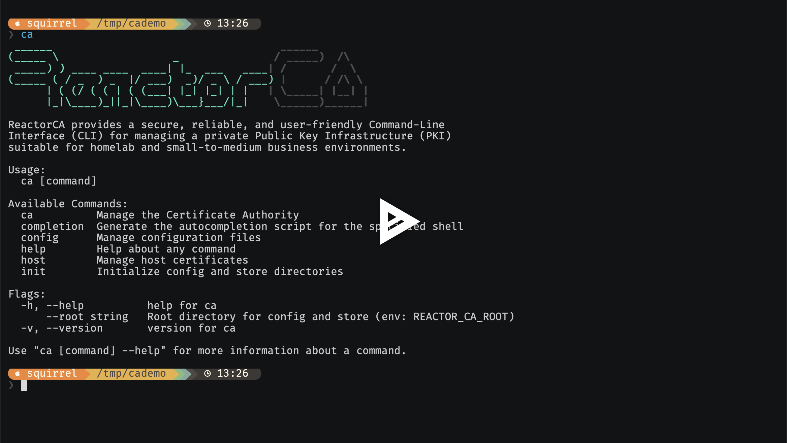

[](https://asciinema.org/a/730862)


[](https://opensource.org/license/bsd-2-clause)
[](https://pkg.go.dev/reactor.de/reactor-ca)

# ReactorCA

A Go CLI tool to manage a homelab/small-office Certificate Authority with centrally managed, [age](https://age-encryption.org/) encrypted private keys.

Typical usage scenario: Run it on your desktop once a year or once a month to issue and deploy TLS certificates for your LAN/VPN devices, enabling them to provide HTTPS access without warnings. For easy management, you can keep your (encrypted) CA store and configuration within a Git repository.

## Table of Contents

* [Features](#features)
* [Motivation and Design Targets](#motivation-and-design-targets)
* [Cryptographic Implementation](#cryptographic-implementation)
  * [Core Libraries](#core-libraries)
  * [Key Protection](#key-protection)
* [Installation](#installation)
  * [Pre-built Binaries](#pre-built-binaries)
  * [Build from Source](#build-from-source)
* [Quick Start](#quick-start)
  * [1. Initialize Configuration](#1-initialize-configuration)
  * [2. Create CA Certificate](#2-create-ca-certificate)
  * [3. Issue Host Certificate](#3-issue-host-certificate)
  * [4. List Certificates](#4-list-certificates)
  * [5. Export and Deploy Certificates](#5-export-and-deploy-certificates)
* [CLI Reference](#cli-reference)
  * [Global Flags](#global-flags)
  * [CA Management](#ca-management)
  * [Host Certificate Management](#host-certificate-management)
  * [Configuration Management](#configuration-management)
* [Common Workflows](#common-workflows)
  * [New CA Workflow](#new-ca-workflow)
  * [Import Existing CA](#import-existing-ca)
  * [Certificate Renewal](#certificate-renewal)
  * [Key Rotation](#key-rotation)
* [Emergency Access](#emergency-access)
* [Configuration](#configuration)
  * [CA Configuration (config/ca.yaml)](#ca-configuration-configcayaml)
  * [Hosts Configuration (config/hosts.yaml)](#hosts-configuration-confighostsyaml)
* [X.509 Certificate Extensions](#x509-certificate-extensions)
  * [Certificate Defaults](#certificate-defaults)
  * [Extension Examples by Use Case](#extension-examples-by-use-case)
  * [Available Extensions](#available-extensions)
    * [Basic Constraints](#basic-constraints)
    * [Key Usage](#key-usage)
    * [Extended Key Usage](#extended-key-usage)
    * [Subject Key Identifier](#subject-key-identifier)
    * [Authority Key Identifier](#authority-key-identifier)
    * [Name Constraints](#name-constraints)
    * [CRL Distribution Points](#crl-distribution-points)
    * [Custom Extensions (Unknown OIDs)](#custom-extensions-unknown-oids)
      * [Value Encoding Notation](#value-encoding-notation)
      * [Examples](#examples)
* [Store Structure](#store-structure)
* [Cryptographic Options](#cryptographic-options)
  * [Supported Key Algorithms](#supported-key-algorithms)
  * [Supported Hash Algorithms](#supported-hash-algorithms)
  * [Subject Alternative Name Types](#subject-alternative-name-types)
* [Key Protection and Authentication](#key-protection-and-authentication)
  * [Password-based Encryption (default)](#password-based-encryption-default)
  * [SSH Key-based Encryption (age-ssh)](#ssh-key-based-encryption-age-ssh)
  * [Hardware Token Encryption (age plugins)](#hardware-token-encryption-age-plugins)
* [Intermediate CAs](#intermediate-cas)
* [agenix integration](#agenix-integration)
* [Development](#development)
* [Browser Compatibility Matrix](#browser-compatibility-matrix)
* [Limitations](#limitations)
* [Alternative Solutions](#alternative-solutions)
* [Further Reading: Introduction to PKI and X.509](#further-reading-introduction-to-pki-and-x509)

## Features

- Create and manage a self-signed Certificate Authority
- Generate and renew certificates for hosts/services and other entities
- Strong key encryption with multiple providers:
  - Password-based encryption using age with scrypt key derivation
  - SSH key-based encryption using existing SSH identities (age-ssh)
  - Hardware token encryption using age plugins (Secure Enclave, YubiKey, etc.)
- Certificate inventory and expiration tracking
- Simple deployment to target locations via shell scripts, for example directly to your [FritzBox](example_config/hosts.yaml#L21), [Proxmox PVE instance](example_config/hosts.yaml#L74) or [NixOS configuration](example_config/hosts.yaml#L92)
- Single statically-linked binary with no runtime dependencies

For a quick overview, maybe you want to have a look at the [example configs](example_config/).

[↑ TOC](#table-of-contents)

## Motivation and Design Targets

Running your own CA works well to provide X.509 certificates to internal hosts and services, for them to offer TLS encryption. But certificate lifetimes are nowadays, 2025, limited to one year (by Apple at least), and the [Industry \[is\] to Shift to 47-Day SSL/TLS Certificate Validity by 2029](https://www.thesslstore.com/blog/47-day-ssl-certificate-validity-by-2029/).

> The certificate lifespan reductions will be implemented in phases:
> - ~6 months (starting March 2026),
> - ~3 months (starting March 2027), and
> - 1.5 months (starting March 2029)

Therefore a one-button reissue & deploy solution is required, easily manageable as part of an infrastructure Git repo.

- “Inversion of control” of traditional CA flow: CSRs are rare, all keys are managed centrally
- Easily rekey, reissue and deploy to many hosts with a single command, so certificates can be kept fresh with minimal infrastructure and configuration
- Encryption of private keys, so config and store can be shared via Git
- Modern CLI
- Sane and secure defaults
- Easy to deploy and package
- Proper documentation including basic X.509/CA knowledge

[↑ TOC](#table-of-contents)

## Cryptographic Implementation

ReactorCA is built on proven cryptographic foundations:

### Core Libraries

- **Go Standard Crypto**: Uses `crypto/x509` for certificate operations, `crypto/rsa` and `crypto/ecdsa` for key generation, and `crypto/rand` for secure randomness
- **age Encryption**: Modern file encryption using [Filippo Valsorda's age library](https://github.com/FiloSottile/age) for private key protection

### Key Protection

Private keys are stored as `.key.age` files, protected by the age encryption format. All methods use ChaCha20-Poly1305 for the actual encryption, with different approaches for securing the file key:

Password protection:

- scrypt derives a key from your password
- This key encrypts the file key in the age header
- Password strength directly impacts security

SSH key protection:

- Your SSH private key decrypts the file key
- Optional additional password protection
- Works with Ed25519, RSA, and ECDSA keys

Hardware security:

- Hardware device required to decrypt the file key
- YubiKey PIV slots via [`age-plugin-yubikey`](https://github.com/str4d/age-plugin-yubikey)
- Apple Secure Enclave (Touch ID) via [`age-plugin-se`](https://github.com/remko/age-plugin-se)
- TPM support via [`age-plugin-tpm`](https://github.com/Foxboron/age-plugin-tpm)
- Etc.

[↑ TOC](#table-of-contents)

## Installation

### Pre-built Binaries

Download the latest release for your platform from the [releases page](https://github.com/serpent213/reactor-ca/releases).

### Build from Source

```bash
git clone https://github.com/serpent213/reactor-ca.git
cd reactor-ca
go build -o ca ./cmd/ca
```

[↑ TOC](#table-of-contents)

## Quick Start

### 1. Initialize Configuration

First, create the default config files:

```bash
ca init
```

ReactorCA automatically detects your SSH keys and configures encryption accordingly:
- **SSH keys found**: Uses SSH-based encryption (prefers Ed25519 over RSA)
- **No SSH keys**: Falls back to password-based encryption

This creates configuration files in the `config/` directory. Edit them according to your needs.

### 2. Create CA Certificate

After editing the configuration, create the CA:

```bash
ca ca create
```

This creates a self-signed CA certificate and private key (encrypted with the password you provide).

### 3. Issue Host Certificate

To issue a certificate for a host defined in your hosts.yaml:

```bash
ca host issue web-server-example
```

### 4. List Certificates

To list all certificates with their expiration dates:

```bash
ca host list
```

### 5. Export and Deploy Certificates

ReactorCA supports flexible certificate export and deployment:

**Export only** (automatic during certificate issuance):
```bash
ca host issue web-server-example  # Exports to configured paths automatically
```

**Deploy only** (run deployment commands independently):
```bash
ca host deploy web-server-example  # Runs deployment without re-issuing
```

**Issue, export and deploy together**:
```bash
ca host issue web-server-example --deploy  # Issue certificate then deploy
```

Deploy will create temp files if the required files are not exported, so `export` and `deploy` options can be used independently from each other.

Deploy scripts run in Bash, except for Windows where they run in PowerShell.

[↑ TOC](#table-of-contents)

## CLI Reference

### Global Flags

- `--root <path>` - Root directory for config and store (env: `REACTOR_CA_ROOT`)

### CA Management

| Command                                   | Description                                                         |
|-------------------------------------------|---------------------------------------------------------------------|
| `ca ca create`                            | Create a new CA key and self-signed certificate                     |
| `ca ca renew`                             | Renew the CA certificate using the existing key                     |
| `ca ca rekey`                             | Create a new key and certificate, replacing the old ones            |
| `ca ca info`                              | Display detailed information about the CA certificate               |
| `ca ca info --openssl`                    | Invoke `openssl` to display full text dump                          |
| `ca ca import --cert <path> --key <path>` | Import an existing CA certificate and private key                   |
| `ca ca export-key`                        | Export unencrypted CA private key to stdout                         |
| `ca ca export-key -o file.key`            | Export CA private key to file                                       |
| `ca ca reencrypt`                         | Change the master password/update recipients for all encrypted keys |

### Host Certificate Management

| Command                                      | Description                                       |
|----------------------------------------------|---------------------------------------------------|
| `ca host issue <host-id>`                    | Issue/renew a certificate for a host              |
| `ca host issue --all`                        | Issue/renew certificates for all hosts            |
| `ca host issue <host-id> --rekey`            | Force generation of a new private key             |
| `ca host issue <host-id> --deploy`           | Issue and deploy certificate in one step          |
| `ca host list`                               | List all host certificates with their status      |
| `ca host list --expired`                     | Show only expired certificates                    |
| `ca host list --expiring-in 30`              | Show certificates expiring in next 30 days        |
| `ca host list --json`                        | Output in JSON format                             |
| `ca host info <host-id>`                     | Display detailed certificate information          |
| `ca host info <host-id> --openssl`           | Invoke `openssl` to display full text dump        |
| `ca host deploy <host-id>`                   | Run deployment command for a host                 |
| `ca host deploy --all`                       | Deploy all host certificates                      |
| `ca host export-key <host-id>`               | Export unencrypted private key to stdout          |
| `ca host export-key <host-id> -o file.key`   | Export private key to file                        |
| `ca host import-key <host-id> --key <path>`  | Import existing private key                       |
| `ca host sign-csr --csr <path> --out <path>` | Sign external CSR                                 |
| `ca host clean`                              | Remove certificates for hosts no longer in config |

### Configuration Management

| Command                                      | Description                                       |
|----------------------------------------------|---------------------------------------------------|
| `ca config validate`                         | Validate configuration files                      |

[↑ TOC](#table-of-contents)

## Common Workflows

### New CA Workflow

```bash
# Initialize configuration
ca init

# Edit configuration
vim config/ca.yaml

# Create the CA
ca ca create

# Edit host configuration
vim config/hosts.yaml

# Issue certificates
ca host issue web-server-example
```

### Import Existing CA

```bash
# Initialize configuration (optional)
ca init

# Import existing CA
ca ca import --cert path/to/ca.crt --key path/to/ca.key

# Edit host configuration
vim config/hosts.yaml

# Issue certificates
ca host issue web-server-example
```

### Certificate Renewal

```bash
# Renew a specific certificate
ca host issue web-server-example

# Renew all certificates
ca host issue --all

# Renew and deploy
ca host issue web-server-example --deploy
```

### Key Rotation

```bash
# Rotate the CA key and certificate
ca ca rekey

# Rotate a specific host key and certificate
ca host issue web-server-example --rekey

# Rotate all host keys and certificates, run all deploy scripts
ca host issue --all --rekey --deploy
```

All modifications to the store are recorded in `store/ca.log`.

[↑ TOC](#table-of-contents)

## Emergency Access

If ReactorCA cannot be run, you can manually decrypt private keys using the `age` command:

```bash
# Decrypt CA private key (SSH-based encryption)
age -d -i ~/.ssh/id_ed25519 store/ca/ca.key.age > ca.key

# Decrypt host private key
age -d -i ~/.ssh/id_ed25519 store/hosts/web-server/cert.key.age > host.key
```

The store structure is simple: certificates are in PEM format (`.crt` files) and private keys are age-encrypted (`.key.age` files). Your encryption method determines which identity file to use with `age -d -i`.

[↑ TOC](#table-of-contents)

## Configuration

### CA Configuration (`config/ca.yaml`)

```yaml
ca:
  # Subject details for the CA certificate
  subject:
    common_name: Reactor Homelab CA
    organization: Reactor Industries
    organizational_unit: IT Department
    country: DE
    state: Berlin
    locality: Berlin
    email: "admin@example.dev"

  # Certificate validity
  validity:
    years: 10

  # Cryptographic settings
  key_algorithm: ECP384    # RSA2048, RSA3072, RSA4096, ECP256, ECP384, ECP521, ED25519
  hash_algorithm: SHA384   # SHA256, SHA384, SHA512

  # X.509 certificate extensions (optional) - see X.509 Certificate Extensions section for details
  extensions:
    basic_constraints:
      path_length: 0       # There can be only one CA!
    name_constraints:      # Good idea to tighten security
      critical: true
      permitted_dns_domains: [".homelab.local", ".internal"]
      permitted_ip_ranges: ["192.168.0.0/16", "10.0.0.0/8"]

# Encryption configuration
encryption:
  provider: password  # password | ssh | plugin

  password:
    min_length: 12
    env_var: REACTOR_CA_PASSWORD

  ssh:
    identity_file: "~/.ssh/id_ed25519"  # SSH private key for decryption
    recipients:  # SSH public keys for encryption
      - "ssh-ed25519 AAAAC3NzaC1lZDI1NTE5AAAAIExample user@host"
      - "ssh-rsa AAAAB3NzaC1yc2EAAAADAQABAAABgExample user@host"

  plugin:
    identity_file: "~/.age/plugin-identity.txt"  # age plugin identity
    recipients:  # age plugin recipients
      - "age1se1qgg72x2qfk9wg3wh0qg9u0v7l5dkq4jx69fv80p6wdus3ftg6flwgjgtev8"  # Secure Enclave
      - "age1yubikey1qgg72x2qfk9wg3wh0qg9u0v7l5dkq4jx69fv80p6wdus3ftg6flwgjgtev8"  # YubiKey
```

### Hosts Configuration (`config/hosts.yaml`)

Host certificates inherit CA subject fields (organization, country, etc.) when not specified, **except** `common_name` which must be explicitly set for each host, if desired.

In that case, `common_name` must also be listed in `alternative_names.dns`. [RFC 2818](https://datatracker.ietf.org/doc/html/rfc2818#section-3.1) (2000) deprecates the use of Common Name for host identities.

```yaml
hosts:
  web-server-example:
    # Subject Alternative Names
    alternative_names:
      dns:
        - web.reactor.local
        - grafana.reactor.local
      ip:
        - 192.168.1.100
        - 10.10.0.1

    # Certificate validity
    validity:
      years: 1

    # Cryptographic settings (optional, defaults to CA settings)
    key_algorithm: RSA2048
    hash_algorithm: SHA256

    # X.509 certificate extensions (optional) - see X.509 Certificate Extensions section for all options
    # extensions:
    #   custom_homelab_tag:          # Custom extension for environment identification
    #     critical: false
    #     oid: "1.3.6.1.4.1.99999.1"
    #     asn1:
    #       string: "homelab-production"

    # Export paths (optional) - files written during 'host issue'
    export:
      cert: "/etc/ssl/certs/web-server.pem"           # Certificate in PEM format
      chain: "/etc/ssl/certs/web-server-chain.pem"    # Certificate + CA chain
      key_encrypted: "/etc/ssl/private/web-server.key.age"  # Encrypted private key (age format)

    # Deployment commands (optional) - executed during 'host deploy'
    # Deploy can run independently or together with issue (--deploy flag)
    # Variables available:
    # - ${cert}: Certificate file (from export.cert or temporary file)
    # - ${chain}: Certificate chain (from export.chain or temporary file)
    # - ${key_encrypted}: Encrypted private key (from export.key_encrypted or temporary file)
    # - ${private_key}: Temporary unencrypted private key (secure, auto-cleanup)
    deploy:
      command: |
        echo 'Deploying certificates...'
        scp ${cert} ${chain} server:/etc/ssl/
        ssh server systemctl reload nginx
```

For detailed information about certificate extensions (Key Usage, Extended Key Usage, Name Constraints, custom OIDs, etc.), see the **[X.509 Certificate Extensions](#x509-certificate-extensions)** section.

[↑ TOC](#table-of-contents)

## X.509 Certificate Extensions

ReactorCA supports fine-grained configuration of X.509 certificate extensions for both CA and host certificates. Extensions provide additional constraints, identifiers, and capabilities beyond the basic certificate fields.

### Certificate Defaults

ReactorCA provides sensible defaults for basic TLS use cases:

- **CA certificates** (`ca ca create`, `ca ca renew`, `ca ca rekey`):
  - Basic Constraints (critical, `CA=true`)
  - Key Usage (critical, `cert_sign` + `crl_sign`)

- **Host certificates** (`ca host issue`):
  - Key Usage (`digital_signature` + `key_encipherment`)
  - Extended Key Usage (`server_auth` + `client_auth`)
  - Subject Alternative Names are populated from `alternative_names` configuration

When you specify extensions, ReactorCA applies defaults first, then merges your configuration at the field level.

### Extension Examples by Use Case

**Homelab CA with Name Constraints** (recommended for security):
```yaml
ca:
  extensions:
    basic_constraints:
      critical: true
      ca: true
      path_length: 0        # No intermediate CAs allowed
    name_constraints:
      critical: true
      permitted_dns_domains: [".homelab.local", ".internal"]
      permitted_ip_ranges: ["192.168.0.0/16", "10.0.0.0/8"]
```

**Web Server Certificate**:
```yaml
hosts:
  web-server:
    extensions:
      key_usage:
        critical: false
        digital_signature: true
        key_encipherment: true
      extended_key_usage:
        critical: false
        server_auth: true
        client_auth: true    # For mutual TLS
```

**Code Signing Certificate** (disable TLS capabilities):
```yaml
hosts:
  code-signer:
    extensions:
      key_usage:
        critical: true
        digital_signature: true
        content_commitment: true  # Non-repudiation for code signing
      extended_key_usage:
        critical: true
        server_auth: false        # Disable TLS server auth
        client_auth: false        # Disable TLS client auth
        code_signing: true        # Enable code signing only
```

**Email Certificate** (S/MIME only, no TLS):
```yaml
hosts:
  email-cert:
    extensions:
      key_usage:
        critical: false
        digital_signature: true
        content_commitment: true  # Non-repudiation for email
        key_encipherment: true    # For encrypted email
      extended_key_usage:
        critical: false
        server_auth: false        # Disable TLS server auth
        client_auth: false        # Disable TLS client auth
        email_protection: true    # Enable S/MIME email protection
```

### Available Extensions

See [RFC 5280](https://datatracker.ietf.org/doc/html/rfc5280#section-4.2) for details.

#### Basic Constraints
Controls whether a certificate can act as a CA and limits certification path length.

```yaml
extensions:
  basic_constraints:
    critical: true                   # Must be critical for CA certificates
    ca: true                         # Whether this certificate can sign other certificates
    path_length: 2                   # Maximum intermediate CAs in the chain (optional, default unset)
```

#### Key Usage
Specifies the cryptographic operations for which the public key may be used.

```yaml
extensions:
  key_usage:
    critical: true                   # Recommended for CAs
    digital_signature: true          # Digital signatures (excluding certificates and CRLs)
    content_commitment: true         # Non-repudiation (formerly called non_repudiation)
    key_encipherment: true           # Key transport (RSA encryption)
    data_encipherment: true          # Data encryption (rarely used)
    key_agreement: true              # Key agreement (ECDH, DH)
    key_cert_sign: true              # Certificate signing (required for CAs)
    crl_sign: true                   # CRL signing (recommended for CAs)
    encipher_only: true              # Restrict key agreement to encryption only
    decipher_only: true              # Restrict key agreement to decryption only
```

#### Extended Key Usage
Defines specific purposes for which the public key may be used, beyond basic cryptographic operations.

```yaml
extensions:
  extended_key_usage:
    critical: false                  # Usually not critical for compatibility
    server_auth: true                # TLS server authentication (1.3.6.1.5.5.7.3.1)
    client_auth: true                # TLS client authentication (1.3.6.1.5.5.7.3.2)
    code_signing: true               # Code signing (1.3.6.1.5.5.7.3.3)
    email_protection: true           # S/MIME email protection (1.3.6.1.5.5.7.3.4)
    time_stamping: true              # Time stamping (1.3.6.1.5.5.7.3.8)
    ocsp_signing: true               # OCSP response signing (1.3.6.1.5.5.7.3.9)
    unknown_ext_key_usage:           # Custom EKU OIDs
      - "1.3.6.1.4.1.311.10.3.4"     # Microsoft EFS
      - "1.3.6.1.5.5.7.3.21"         # SSH client authentication
```

#### Subject Key Identifier
Provides a means of identifying certificates that contain a particular public key.

```yaml
extensions:
  subject_key_identifier:
    critical: false                  # Never critical per RFC 5280
    method: "hash"                   # "hash" (SHA-1 of public key) or "manual"
    manual_value: "hex:01234567..."  # Required when method is "manual"
```

#### Authority Key Identifier
Identifies the public key corresponding to the private key used to sign a certificate.

```yaml
extensions:
  authority_key_identifier:
    critical: false                  # Never critical per RFC 5280
    key_id: "hex:FEDCBA98..."        # Key identifier (usually matches issuer's SKI)
```

#### Name Constraints
**Powerful security feature**: Restricts the namespace within which all subject names in subsequent certificates must be located. Ideal for homelab CAs to prevent certificate misuse.

```yaml
extensions:
  name_constraints:
    critical: true                       # Should be critical for security
    permitted_dns_domains:
      - ".homelab.local"                 # Permits subdomains of homelab.local
      - ".internal"                      # Permits *.internal domains
    excluded_dns_domains:
      - ".example.com"                   # Explicitly excludes example.com
    permitted_ip_ranges:
      - "192.168.0.0/16"                 # Private network ranges
      - "10.0.0.0/8"
      - "172.16.0.0/12"
    excluded_ip_ranges:
      - "169.254.0.0/16"                 # Link-local addresses
    permitted_email_addresses:
      - "homelab.local"                  # Domain constraint for email
      - "admin@homelab.local"            # Specific email address
    excluded_email_addresses:
      - "test@example.com"
    permitted_uri_domains:
      - "homelab.local"                  # Permits URIs with homelab.local domain
    excluded_uri_domains:
      - "public.example.com"             # Excludes URIs with public.example.com domain
```

#### CRL Distribution Points
Specifies where Certificate Revocation Lists (CRLs) can be retrieved for checking certificate revocation status. Supports multiple distribution points with optional reason codes.

```yaml
extensions:
  crl_distribution_points:
    critical: false                      # Usually not critical for compatibility
    distribution_points:
      - urls:
          - "http://crl.example.com/ca.crl"           # HTTP CRL endpoint
          - "ldap://ldap.example.com/cn=CA,dc=example,dc=com"  # LDAP CRL endpoint
        reasons: [key_compromise, ca_compromise]      # Optional: specific revocation reasons
      - urls:
          - "http://backup-crl.example.com/ca.crl"    # Backup CRL endpoint
        # No reasons specified = all revocation reasons
```

**Supported CRL Reasons**:
- `unspecified` - General revocation
- `key_compromise` - Private key compromised
- `ca_compromise` - CA key compromised
- `affiliation_changed` - Subject's affiliation changed
- `superseded` - Certificate replaced
- `cessation_of_operation` - Entity ceased operation
- `certificate_hold` - Temporary revocation
- `privilege_withdrawn` - Privileges revoked
- `aa_compromise` - Attribute authority compromised

#### Custom Extensions (Unknown OIDs)
Define custom extensions using Object Identifiers (OIDs) with flexible encoding options. Start the extension name with `custom_`.

##### Value Encoding Notation

ReactorCA supports multiple encoding formats for custom extension values:

**Simple Encodings:**
- `base64: "data"` - Base64-encoded binary data
- `hex: "data"` - Hexadecimal-encoded binary data

**ASN.1 Types:**
- `asn1: {string: "text"}` - UTF-8 string
- `asn1: {int: 123}` - Integer value
- `asn1: {bool: true}` - Boolean value
- `asn1: {oid: "1.2.3.4"}` - Object identifier
- `asn1: {sequence: [{string: "foo"}, {int: 64}]}` - SEQUENCE of values
- `asn1: {octetstring: {string: "wrapped data"}}` - OCTET STRING wrapper
- `asn1: {bitstring: "10110000"}` - BIT STRING from binary string
- `asn1: {bitstring: [0, 2, 3]}` - BIT STRING from bit positions

##### Examples

```yaml
extensions:
  custom_policy_extension:
    oid: "1.3.6.1.4.1.12345.1.2.3"       # Your organization's OID space
    base64: "SGVsbG8gV29ybGQ="           # Base64-encoded data

  custom_device_metadata:
    oid: "1.3.6.1.4.1.12345.100"
    # Structured device information using SEQUENCE
    asn1:
      sequence:
        - string: "raspberry-pi"
        - string: "homelab"
        - int: 2024

  custom_permissions:
    oid: "1.3.6.1.4.1.12345.200"
    # Permission flags using BIT STRING (read=bit0, write=bit1, admin=bit3)
    asn1:
      bitstring: [0, 1, 3]

  custom_wrapped_data:
    oid: "1.3.6.1.4.1.12345.300"
    # OCTET STRING containing UTF8 string
    asn1:
      octetstring:
        string: "Environment=Production"

  custom_simple_tag:
    oid: "1.3.6.1.4.1.12345.3"
    asn1:
      string: "homelab-production"  # ASN.1 UTF8String

  custom_build_number:
    oid: "1.3.6.1.4.1.12345.4"
    asn1:
      int: 42                 # ASN.1 INTEGER

  custom_enabled_flag:
    critical: true
    oid: "1.3.6.1.4.1.12345.5"
    asn1:
      bool: true              # ASN.1 BOOLEAN
```

[↑ TOC](#table-of-contents)

## Store Structure

```raw
store/
├── ca/
│   ├── ca.crt           # CA certificate (PEM format)
│   └── ca.key.age       # age-encrypted CA private key
├── hosts/
│   └── <host-id>/
│       ├── cert.crt     # Host certificate (PEM format)
│       └── cert.key.age # age-encrypted host private key
└── ca.log               # Operation log
```

[↑ TOC](#table-of-contents)

## Cryptographic Options

See [browser support matrix](#browser-compatibility-matrix) for real-life test results.

Rule of thumb: use ECP; for cheap Chinese plastic appliances it might be necessary to fall back to RSA2048-SHA256.

### Supported Key Algorithms

| Algorithm | Key Size | Performance | Security    | Compatibility |
|-----------|----------|-------------|-------------|---------------|
| RSA2048   | 2048-bit | Medium      | Good        | Excellent     |
| RSA3072   | 3072-bit | Slow        | Strong      | Excellent     |
| RSA4096   | 4096-bit | Slow        | Very Strong | Excellent     |
| ECP256    | P-256    | Fast        | Strong      | Good          |
| ECP384    | P-384    | Medium      | Very Strong | Good          |
| ECP521    | P-521    | Medium      | Very Strong | Good          |
| ED25519   | 256-bit  | Very Fast   | Strong      | Limited       |

### Supported Hash Algorithms

- **SHA256**: Good default, excellent compatibility
- **SHA384**: Stronger, recommended for ECP384 and higher
- **SHA512**: Strongest, for high-security environments

### Subject Alternative Name Types

ReactorCA supports multiple SAN types:

```yaml
alternative_names:
  dns:
    - example.com
    - "*.example.com"
  ip:
    - 192.168.1.100
    - "2001:db8::1"
  email:
    - "admin@example.com"
  uri:
    - "https://example.com"
```

Note that `alternative_name` is special, for convenience it is an entity-level parameter for an extension, which usually live under `extensions`.

[↑ TOC](#table-of-contents)

## Key Protection and Authentication

ReactorCA supports multiple encryption providers for private key protection:

### Password-based Encryption (default)

Password sources are checked in order:
1. **Password File**: Specified in `ca.yaml` under `password.file`
2. **Environment Variable**: Set via `REACTOR_CA_PASSWORD` (or custom env var)
3. **Interactive Prompt**: Secure terminal input (fallback)

### SSH Key-based Encryption (age-ssh)

Uses existing SSH infrastructure for key protection:
- **Identity File**: Your SSH private key (e.g., `~/.ssh/id_ed25519`)
- **Recipients**: SSH public keys that can decrypt the private keys
- **Supports**: Ed25519, RSA, and ECDSA SSH keys
- **No passwords required**: Leverages SSH agent or unlocked SSH keys

### Hardware Token Encryption (age plugins)

Uses age plugins for hardware-backed key protection:
- **Identity File**: Plugin identity file (e.g., `~/.age/plugin-identity.txt`)
- **Recipients**: Hardware token public keys (e.g., Secure Enclave, YubiKey)
- **Supports**: Any age-plugin-* binary (secure-enclave, yubikey, tpm, etc.)
- **Hardware security**: Private keys never leave the secure hardware

[↑ TOC](#table-of-contents)

## Intermediate CAs

Currently, ReactorCA is primarily designed for a very basic setup: A single root CA directly signs all certificates without intermediaries. But you should be fine creating an intermediate CA manually and importing it into ReactorCA, then using it for your everyday operation.

[↑ TOC](#table-of-contents)

## agenix integration

If you are using [agenix](https://github.com/ryantm/agenix) (or a similar system) for secret distribution, you can share secrets between ReactorCA and agenix, usually by employing the `additional_recipients` option. Note that password encryption does NOT mix with age-ssh or plugin modes for security reasons.

[↑ TOC](#table-of-contents)

## Development

This project uses `devenv.nix` for reproducible development and Just as build helper:

```bash
# Enter development shell
devenv shell

# List commands
just

# Most important
just build && ./ca --version
just docs
just lint
just test
just check
```

PRs to the `develop` branch welcome!

[↑ TOC](#table-of-contents)

## Browser Compatibility Matrix

| Key/Signature | Firefox<br>141.0-macOS | Firefox<br>140.0-CI | Chromium<br>139.0-CI | Webkit<br>26.0-CI | Curl<br>8.5-CI |
|---|---|---|---|---|---|
| RSA2048-SHA256 | 🟢 PASS | 🟢 PASS | 🟢 PASS | 🟢 PASS | 🟢 PASS |
| RSA2048-SHA512 | 🟢 PASS | 🔴 FAIL | 🟢 PASS | 🔴 FAIL | 🟢 PASS |
| RSA3072-SHA256 | 🟢 PASS | 🔴 FAIL | 🔴 FAIL | 🔴 FAIL | 🟢 PASS |
| RSA3072-SHA512 | 🟢 PASS | 🔴 FAIL | 🔴 FAIL | 🔴 FAIL | 🟢 PASS |
| RSA4096-SHA256 | 🟢 PASS | 🔴 FAIL | 🔴 FAIL | 🔴 FAIL | 🟢 PASS |
| RSA4096-SHA512 | 🟢 PASS | 🔴 FAIL | 🔴 FAIL | 🔴 FAIL | 🟢 PASS |
| ECP256-SHA256 | 🟢 PASS | 🔴 FAIL | 🔴 FAIL | 🔴 FAIL | 🟢 PASS |
| ECP256-SHA512 | 🟢 PASS | 🔴 FAIL | 🔴 FAIL | 🔴 FAIL | 🟢 PASS |
| ECP384-SHA256 | 🟢 PASS | 🔴 FAIL | 🔴 FAIL | 🔴 FAIL | 🟢 PASS |
| ECP384-SHA512 | 🟢 PASS | 🔴 FAIL | 🔴 FAIL | 🔴 FAIL | 🟢 PASS |
| ECP521-SHA256 | 🟢 PASS | 🔴 FAIL | 🔴 FAIL | 🔴 FAIL | 🟢 PASS |
| ECP521-SHA512 | 🟢 PASS | 🔴 FAIL | 🔴 FAIL | 🔴 FAIL | 🟢 PASS |
| ED25519-SHA256 | 🔴 FAIL | 🔴 FAIL | 🔴 FAIL | 🔴 FAIL | 🟢 PASS |
| ED25519-SHA512 | 🔴 FAIL | 🔴 FAIL | 🔴 FAIL | 🔴 FAIL | 🟢 PASS |

* ED25519 not recommended for general public in 2025.
* Apparently, the browsers used by Microsoft's Playwright container in the [Github Action](https://github.com/serpent213/reactor-ca/actions/workflows/browsers.yml) have very limited crypto support.
* Local tests won't run with Chrome, so far, and won't succeed with Safari on my machine. To run:

  ```sh
  just test browser
  just update-browser-matrix
  ```

[↑ TOC](#table-of-contents)

## Limitations

- No intermediate CA support
- No certificate revocation (CRL/OCSP) support
- No PKCS#12 bundle creation
- No automated renewal daemon (use cron/systemd timers)

[↑ TOC](#table-of-contents)

## Alternative Solutions

- [XCA](https://www.hohnstaedt.de/xca/): great, simple GUI-based CA
- [certstrap](https://github.com/square/certstrap): didn't know about it before starting  ;)
- [EasyRSA](https://github.com/OpenVPN/easy-rsa): a classic
- [CFSSL](https://github.com/cloudflare/cfssl): powerful client-server solution (there'a also a [wrapper](https://github.com/1nfiniteloop/docker-pki))
- [step-ca](https://smallstep.com/docs/step-ca/): fully fledged server with ACME support

[↑ TOC](#table-of-contents)

## Further Reading: Introduction to PKI and X.509

- [Zytrax Survival Guide](https://www.zytrax.com/tech/survival/ssl.html): comprehensive guide and explanation
- [Tutorial by Jamie Nguyen](https://jamielinux.com/docs/openssl-certificate-authority/): demonstrates how to act as your own certificate authority (CA) using the OpenSSL command-line tools

[↑ TOC](#table-of-contents)
